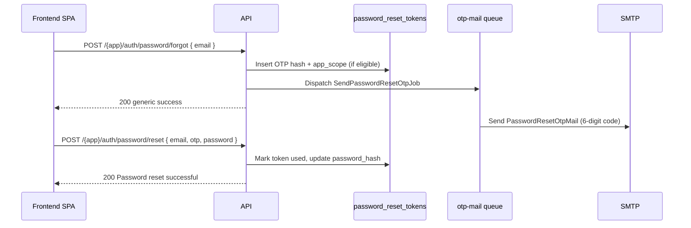

# Password reset OTP — all apps & user roles

**Date:** 2026-06-14  
**Audience:** Main website, Admin dashboard, Organizer dashboard, Scanner app frontends  
**API base:** `https://myticket-api.kat-jr.com/api/v1`

Every micro-frontend exposes the same **6-digit OTP** password reset flow. The user requests a code by email, then submits the code with a new password. OTP delivery is **queued automatically** when a row is inserted into `password_reset_tokens` — a dedicated **`otp-mail`** queue worker sends emails **one at a time** to avoid SMTP overload.

---

## Quick reference — which app to call

| User type | Role(s) | Forgot / reset prefix |
|-----------|---------|------------------------|
| Buyer / guest | `guest` | `/api/v1/main/auth/password/...` |
| Talent | `talent` | `/api/v1/main/auth/password/...` |
| Vendor | `vendor` | `/api/v1/main/auth/password/...` |
| Organizer | `organizer` | `/api/v1/organizer/auth/password/...` (or main if they also use the public site) |
| Guest with approved organizer profile | `guest` + active `organizer_profiles` | `/api/v1/organizer/auth/password/...` |
| Admin | `admin` | `/api/v1/admin/auth/password/...` |
| Scanner staff | `scanner` | `/api/v1/scanner/auth/password/...` |
| Admin using scanner app | `admin` | `/api/v1/scanner/auth/password/...` |

**Important:** Each app only sends OTPs to **eligible** accounts for that app. Calling the wrong prefix returns `200` with a generic message but **does not email** ineligible users (e.g. a scanner email on the main website forgot-password form).

---

## Eligibility matrix

| Role | Main website | Admin dashboard | Organizer dashboard | Scanner app |
|------|:------------:|:---------------:|:-------------------:|:-----------:|
| `guest` | yes | — | yes† | — |
| `talent` | yes | — | — | — |
| `vendor` | yes | — | — | — |
| `organizer` | yes | — | yes | — |
| `admin` | — | yes | — | yes |
| `scanner` | — | — | — | yes |

† Guest with an **active** `organizer_profiles` row (same rule as organizer login).

Suspended or inactive users never receive OTPs on any app.

---

## Flow overview



---

## Endpoints by app

All forgot/reset routes are **public** and throttled (`throttle:auth-login` — 5 requests/min per IP + email).

### Main website (guest, talent, vendor, organizer)

| Method | Path |
|--------|------|
| POST | `/api/v1/main/auth/password/forgot` |
| POST | `/api/v1/main/auth/password/reset` |

Frontend: `https://myticket.kat-jr.com`

---

### Admin dashboard

| Method | Path |
|--------|------|
| POST | `/api/v1/admin/auth/password/forgot` |
| POST | `/api/v1/admin/auth/password/reset` |

Frontend: `https://myticket-admin.kat-jr.com`

**Eligible:** `role = admin` only.

---

### Organizer dashboard

| Method | Path |
|--------|------|
| POST | `/api/v1/organizer/auth/password/forgot` |
| POST | `/api/v1/organizer/auth/password/reset` |

Frontend: organizer dashboard SPA.

**Eligible:** `role = organizer`, or `role = guest` with active organizer profile.

---

### Scanner app

| Method | Path |
|--------|------|
| POST | `/api/v1/scanner/auth/password/forgot` |
| POST | `/api/v1/scanner/auth/password/reset` |

Frontend: scanner micro-frontend.

**Eligible:** `role = scanner` or `role = admin`.

---

## Request bodies

### Forgot password (all apps)

```json
{
  "email": "user@example.com"
}
```

| Field | Required | Rules |
|-------|----------|-------|
| `email` | yes | Valid email |

---

### Reset password (all apps)

```json
{
  "email": "user@example.com",
  "otp": "482913",
  "password": "NewSecurePass123!"
}
```

| Field | Required | Rules |
|-------|----------|-------|
| `email` | yes* | Valid email (*required when using `otp`) |
| `otp` | yes** | Exactly 6 digits (`/^\d{6}$/`) |
| `password` | yes | Min 8 characters |
| `token` | legacy | Optional alternative to `otp` for older main/admin clients |

---

## Responses (identical on all apps)

### Forgot password — success `200`

Always returns the same message (does not reveal whether the email exists or is eligible):

```json
{
  "message": "If the account exists, a verification code has been sent to your email."
}
```

### Forgot password — validation error `422`

```json
{
  "message": "The given data was invalid.",
  "errors": {
    "email": ["The email field is required."]
  }
}
```

### Reset password — success `200`

```json
{
  "message": "Password reset successful."
}
```

After success, redirect the user to that app's login:

| App | Login endpoint |
|-----|----------------|
| Main | `POST /api/v1/main/auth/login` |
| Admin | `POST /api/v1/admin/auth/login` |
| Organizer | `POST /api/v1/organizer/auth/login` |
| Scanner | `POST /api/v1/scanner/auth/login` |

### Reset password — invalid/expired OTP `422`

```json
{
  "message": "Invalid or expired verification code."
}
```

### Reset password — validation error `422`

```json
{
  "message": "The given data was invalid.",
  "errors": {
    "otp": ["The otp format is invalid."],
    "password": ["The password field must be at least 8 characters."]
  }
}
```

---

## OTP email

| App scope | Email subject prefix |
|-----------|---------------------|
| `main_website` | `MyTicket password reset code` |
| `admin_dashboard` | `Admin dashboard password reset code` |
| `organizer_dashboard` | `Organizer dashboard password reset code` |
| `scanner` | `Scanner app password reset code` |

- **Body:** Branded transactional layout; code shown as **`123 456`** (grouped 6 digits)
- **Expiry:** 15 minutes default (`PASSWORD_RESET_OTP_EXPIRES_MINUTES`)
- **Max verify attempts:** 5 per token (`PASSWORD_RESET_OTP_MAX_ATTEMPTS`)
- OTPs are scoped per app — a code requested on organizer cannot be used on main reset (different `app_scope` in DB)

---

## Queue & operations

When forgot-password succeeds for an eligible user:

1. Previous unused OTP rows for the same **user + app scope** are invalidated.
2. A new row is stored in `password_reset_tokens` with `app_scope`, `email_queued_at`.
3. `SendPasswordResetOtpJob` is pushed to the **`otp-mail`** queue.
4. Supervisor worker processes **`otp-mail` first**, then `default`, then `notifications`.

Production worker (see `deploy/supervisor/myticket-api-queue.conf`):

```bash
php artisan queue:work database --queue=otp-mail,default,notifications --sleep=3 --tries=3
```

**Env (optional):**

```env
PASSWORD_RESET_OTP_EXPIRES_MINUTES=15
PASSWORD_RESET_OTP_MAX_ATTEMPTS=5
PASSWORD_RESET_OTP_MAIL_QUEUE=otp-mail
QUEUE_CONNECTION=database
```

Local/tests use `QUEUE_CONNECTION=sync` — job runs immediately during the request.

**Deploy:** run `php artisan migrate` (adds `app_scope`, queue tracking columns on `password_reset_tokens`).

---

## Frontend checklists

### Main website (buyers, talent, vendor)

- [ ] Forgot: `POST /api/v1/main/auth/password/forgot`
- [ ] Reset: `POST /api/v1/main/auth/password/reset` with `email`, `otp`, `password`
- [ ] Success → main login
- [ ] Do **not** use this flow for scanner/admin staff — they need their own app

### Admin dashboard

- [ ] Forgot: `POST /api/v1/admin/auth/password/forgot`
- [ ] Reset: `POST /api/v1/admin/auth/password/reset`
- [ ] Success → admin login

### Organizer dashboard

- [ ] Forgot: `POST /api/v1/organizer/auth/password/forgot`
- [ ] Reset: `POST /api/v1/organizer/auth/password/reset`
- [ ] Success → organizer login

### Scanner app

- [ ] Forgot: `POST /api/v1/scanner/auth/password/forgot`
- [ ] Reset: `POST /api/v1/scanner/auth/password/reset`
- [ ] Success → scanner login

### Shared UX

- [ ] OTP input: 6 digits, numeric keyboard on mobile
- [ ] Show expiry countdown (~15 min)
- [ ] Generic success copy on forgot — never “email not found”
- [ ] Rate limit: 5 forgot requests/min per IP+email

---

## Endpoint summary table

| App | Forgot | Reset |
|-----|--------|-------|
| Main | `POST /api/v1/main/auth/password/forgot` | `POST /api/v1/main/auth/password/reset` |
| Admin | `POST /api/v1/admin/auth/password/forgot` | `POST /api/v1/admin/auth/password/reset` |
| Organizer | `POST /api/v1/organizer/auth/password/forgot` | `POST /api/v1/organizer/auth/password/reset` |
| Scanner | `POST /api/v1/scanner/auth/password/forgot` | `POST /api/v1/scanner/auth/password/reset` |

---

## Tests

- `tests/Feature/Auth/OrganizerScannerPasswordResetTest.php` — organizer, scanner, main, admin flows
- `tests/Feature/Main/MainAuthEndpointsTest.php` — main forgot-password integration

Run on server:

```bash
./vendor/bin/pest tests/Feature/Auth/OrganizerScannerPasswordResetTest.php tests/Feature/Main/MainAuthEndpointsTest.php
```
